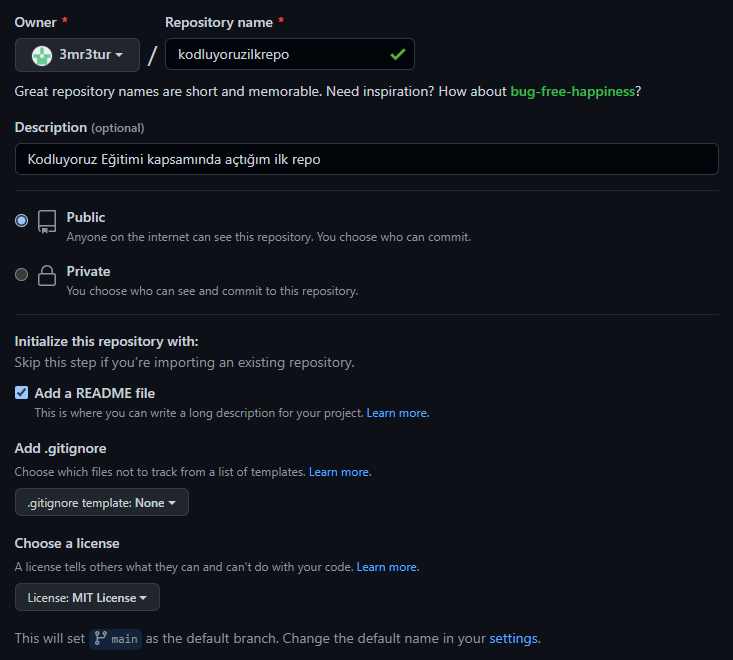

# Kodluyoruz Ilk Repo

Bu repository [Kodluyoruz](https://www.patika.dev/tr) Front-End eğitimi kapsamında oluşturduğum ilk repository. İçerisinde bir adet `README.md` dosyası, bir adet `index.html` belgesi ve bir adet de proje resmi barındırıyor.



## Installation

İlk önce aşağıdaki komutu kullanarak projeyi klonlayın.

```git
git clone https://github.com/3mr3tur/kodluyoruzilkrepo.git
```
## Usage
Projeyi klonladıktan sonra Visual Studio Code programında açınız.

Linux, MacOS ve Windows için;

```git
cd kodluyoruzilkrepo
code .
```

## Contributing

Pull requestler kabul edilir. Büyük değişiklikler için, lütfen önce neyi değiştirmek istediğinizi tartışmak için bir konu açınız.

## Licence

[MIT](https://choosealicense.com/licenses/mit/)